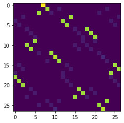
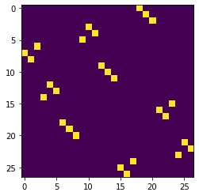
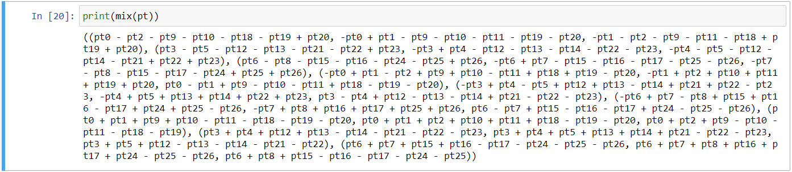
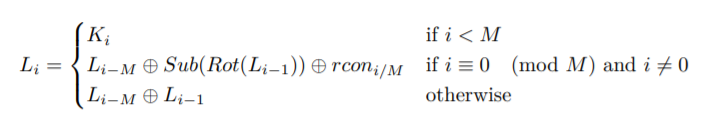
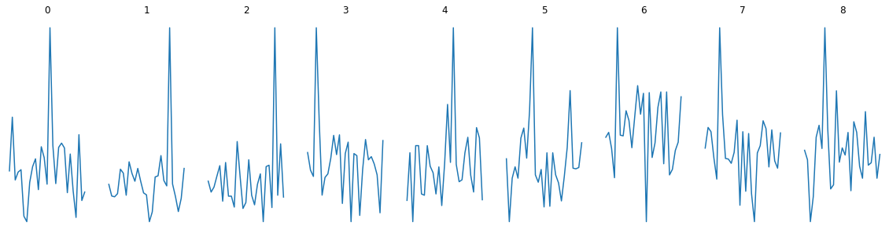
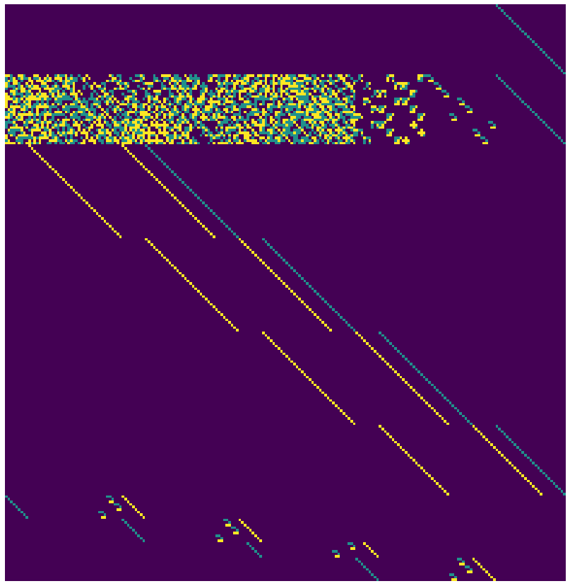

# The Challenge

The challenge is similar to the challenge [A3S](../A3S). We are given an implementation of a cipher `A3S` and a [.pdf](chal/help.pdf) file that briefly explains the cipher. A3S is very similar to AES, with some notable differences:

1. Trits are used instead of bits. This means working in `GF(3)` instead of `GF(2)`.
2. The key expansion allows for keys larger than a round key. This means recovering the last round key isn't enough to recover the original key. This will become relevant later.

We are also given `3^9` plaintext and ciphertext pairs and we have to recover the original key used in order to get the flag. 

## Metadata

So again I didn't solve this challenge during the CTF, but I really liked this challenge so here we are. This is by far the hardest CTF challenge I've solved so thanks for the great run!

Also, this writeup is _long_, it took me a while to write everything down.

# Some A3S Background

As mentioned before, A3S is very similar to [AES](https://en.wikipedia.org/wiki/Advanced_Encryption_Standard). A3S operates on a state of `27` trits, arranged as `3x3` trytes (`3` trits to a tryte, kinda like `8` bits to a byte). The plaintext is converted to this state, which then passes through some operations, and the final state is then converted to the ciphertext.

Just like AES, A3S has the operations for encryption: `substitute`, `shift_rows`, `mix_columns`, `add_round_key`. More details in the [challenge pdf](chal/help.pdf).

An important thing to note is that `shift_rows`, `mix_columns` and `add_round_key` are all linear operations on the state. In a secure implementation, the `substitute` would be the crucial component ensuring the cipher isn't affine, which is Very Very Bad™. See my solution for the challenge [A3S](../A3S). The lookup table for this substitution is the all important `SBOX`.

The key expansion for A3S relies on `substitute` as well to ensure the key expansion isn't affine. This will be important later.

# The Vuln

From now on, assume we are working with `GF(3)` unless stated otherwise. This means if you were to see, say, `2+2`, take modulo 3 and we have `2+2=1`.

I shamefully didn't notice when solving [A3S](../A3S) but the author provided a hint in the [A3S source](chal/mini.py): A comment `Secure enough ig` right above the SBOX that's also present in the [A3S](../A3S) challenge.

So yes! Just like its child challenge, the SBOX is vulnerable. This can be seen by plotting its difference distribution table, which is plotting `a+b` over `SBOX[a] + SBOX[b]`.

```python
from mini import * # Import challenge code

import matplotlib.pyplot as plt
import numpy as np

mat = np.zeros((27,27))
for a in range(27):
    for b in range(27):
        sa, sb = SBOX[a], SBOX[b]
        i = tri_to_int(t_xor(int_to_tyt(a )[0], int_to_tyt(b )[0]))
        o = tri_to_int(t_xor(int_to_tyt(sa)[0], int_to_tyt(sb)[0]))
        mat[o][i] += 1
        
plt.imshow(mat)
plt.show()
```

<p align="center">
  
</p>

This looks bad, as a good SBOX should have a pretty uniform differential table. It's a good indication that the SBOX is _really_ close to being affine, and it's pretty straightforward to derive this affine approximation:

```python
def sbox_affine(i:tuple):
    return (
        (0 + i[0]*1 + i[1]*1 + i[2]*0),
        (0 + i[0]*0 + i[1]*0 + i[2]*1),
        (1 + i[0]*0 + i[1]*2 + i[2]*2)
    )

SBOX_AFFINE = tuple(tri_to_int(sbox_affine(int_to_tyt(a)[0])) for a in range(27))
```

Plotting `SBOX_AFFINE`'s differntial table yields:

<p align="center">
  
</p>

Also `SBOX` and `SBOX_AFFINE` turn out to be _really_ similar:

```python
print(SBOX_AFFINE)
print(SBOX)

# > (9, 10, 11, 1, 2, 0, 20, 18, 19, 3, 4, 5, 22, 23, 21, 14, 12, 13, 24, 25, 26, 16, 17, 15, 8, 6, 7)
# > (9, 10, 11, 1, 2, 0, 20, 18, 19, 3, 4, 5, 22, 23, 21, 14, 12, 26, 24, 25, 13, 16, 17, 15, 8, 6, 7)
```

`SBOX` and `SBOX_AFFINE` differ only in 2 values. This means that `25/27 ~ 93%` of the time, `SBOX` is affine!

Remember how the `SBOX` is the all important component that ensures that the cipher isn't affine? Having `SBOX` behave like an affine transform _most_ of the time is pretty bad.

Now, despite being affine `93%` of the time, it's very unlikely to make a particular instance of A3S encryption entirely affine. Since the SBOX is applied _many many times_ during encryption, there is bound to be once where the SBOX isn't affine, causing the whole encryption to not be affine.

So instead of saying that with this `SBOX`, the A3S approximates an affine transform, it's a better description to say that small sections of an A3S encryption instance is gonna be affine. We don't know where and when these affine portions are, but we can be fairly confident that small parts of it is _likely_ to be affine.

# Attack Approach

Unlike in the previous challenge [A3S](../A3S), it's unlikely that there's a plaintext-ciphertext pair that's completely affine for us to exploit. However, we can exploit the _very probably_ affine-ness of small parts of the encryption.

Furthermore, we'd want to recover all the round keys, which are `3*8*9 = 216` `GF(3)` values. This means that we'd want to recover at least `216` constraints to solve for the round keys. Preferably, these constraints are linear in `GF(3)` to make solving for the round keys really easy.

There are 2 places to get these constraints. The obvious one is the key expansion algorithm itself, and the next is the plaintext-ciphertext pairs.

From now on, `kr` will refer to the round keys, plaintext is `pt` and ciphertext is `ct`.

So here's the plan:

1. Create a symbolic, affine version of the A3S that's a close approximation to the original.
2. Recover as many constraints on `kr` from the key expansion.
3. Correlate the output of our affine A3S with the known `pt` and `ct` pairs to form more constraints on `kr`
4. With hopefully > 216 constraints, we can solve for `kr`.

Recovering all the round keys is equivalent to recovering the original key as the original key is simply the first few round keys.

## Creating a symbolic affine A3S

Just like in the [previous challenge](../A3S), I chose to modify the given implementation to accept `GF(3)` symbolic variables.

First, importing and processing what's given to us from the challenge:

```python
import mini as orig # Import challenge code
from mini import *  # Import challenge code
from out import *   # Import output of challenge code given to us

F = GF(3) # Field we are working in

# Convert known ct to the 3x3 tryte state
server_ct = [up(int_to_tyt(byt_to_int(ct)), W_SIZE ** 2, int_to_tyt(0)[0])[-1] for ct in all_enc]
# Flatten the ct to 27 trit vectors
server_ctv = [vector(F, [i for j in ct for i in j]) for ct in server_ct]
# Convert known pt to the 3x3 tryte state
server_pt = [up(int_to_tyt(pt), W_SIZE ** 2, int_to_tyt(0)[0])[-1] for pt in range(3^9)]
# Flatten the pt to 27 trit vectors
server_ptv = [vector(F, [i for j in pt for i in j]) for pt in server_pt]
```

Creating the symbolic variables:

```python
ptkr = PolynomialRing(F, ['pt%d'%i for i in range(9*3)] + ['kr%d'%i for i in range(9*3*8)]).gens()

# Flattened pt variables
pt_v = ptkr[:9*3]
# pt variables in 3x3 trit format
pt = tuple(tuple(pt_v[i*3:i*3+3]) for i in range(9))
# Flattened kr variables
kr_v = ptkr[9*3:]
# kr variables in 3x3 trit round keys format
kr = tuple(tuple(tuple(kr_v[i*9*3:i*9*3+9*3][j*3:j*3+3]) for j in range(9)) for i in range(8))
```

Now to modify the implementation to be `GF(3)` friendly:

```python
xor = lambda a,b: a+b
uxor = lambda a,b: a-b
t_xor = lambda a,b: tuple(x+y for x,y in zip(a,b))
T_xor = lambda a,b: tuple(t_xor(i,j) for i,j in zip(a,b))
t_uxor = lambda a,b: tuple(x-y for x,y in zip(a,b))
T_uxor = lambda a,b: tuple(t_uxor(i,j) for i,j in zip(a,b))

SBOX_TYT = dict((int_to_tyt(i)[0], int_to_tyt(s)[0]) for i,s in enumerate(SBOX))
ISBOX = tuple(SBOX.index(i) for i in range(27))
ISBOX_TYT = dict((int_to_tyt(i)[0], int_to_tyt(s)[0]) for i,s in enumerate(ISBOX))

def sbox_affine(i:tuple):
    return (
        (0 + i[0]*1 + i[1]*1 + i[2]*0),
        (0 + i[0]*0 + i[1]*0 + i[2]*1),
        (1 + i[0]*0 + i[1]*2 + i[2]*2)
    )

def expand(tyt):
    words   = tyt_to_wrd(tyt) 
    size    = len(words)
    rnum    = size + 3
    rcons   = rcon(rnum * 3 // size)

    for i in range(size, rnum * 3):
        k   = words[i - size]
        l   = words[i - 1]
        if i % size == 0:
            s = tuple(sbox_affine(i) for i in rot_wrd(l))
            k = T_xor(k, s)
            k = (t_xor(k[0], rcons[i // size - 1]),) + k[1:]
        else:
            k = T_xor(k, l)
        words = words + (k,)

    return up(down(words[:rnum * 3]), W_SIZE ** 2, int_to_tyt(0)[0])

def tri_mulmod(A, B, mod=POLY):
    c = [0] * (len(mod) - 1)
    for a in A[::-1]:
        c = [0] + c
        x = tuple(b * a for b in B)
        c[:len(x)] = t_xor(c, x)
        n = -c[-1]*mod[-1]
        c[:] = [x+y*n for x,y in zip(c,mod)]
        c.pop()
    return tuple(c)

def tyt_mulmod(A, B, mod=POLY2, mod2=POLY):
    fil = [(0,) * T_SIZE]
    C = fil * (len(mod) - 1)
    for a in A[::-1]:
        C = fil + C
        x = tuple(tri_mulmod(b, a, mod2) for b in B)
        C[:len(x)] = T_xor(C, x)
        num = modinv(mod[-1], mod2)
        num2 = tri_mulmod(num, C[-1], mod2)
        x = tuple(tri_mulmod(m, num2, mod2) for m in mod)
        C[:len(x)] = T_uxor(C, x)

        C.pop()
    return C

def add(a,b):
    return tuple(
        tuple(x+y for x,y in zip(i,j)) for i,j in zip(a,b)
    )

def sub(a):
    return tuple(
        sbox_affine(x) for x in a
    )

def shift(a):
    return [
        a[i] for i in SHIFT_ROWS
    ]

def mix(tyt):
    tyt = list(tyt)
    for i in range(W_SIZE):
        tyt[i::W_SIZE] = tyt_mulmod(tyt[i::W_SIZE], CONS)
    return tuple(tyt)
```

Now I can simply call, say, `mix(pt)` and get the symbolic representation of `mix`:

<p align="center">
  
</p>

## Scavaging ~168 linear constraints from the key expansion

Refering to the [.pdf](./chal/help.pdf) given:

<p align="center">
  
</p>

The third line is an obvious linear constraint on `kr`. This generates `135` constraints:

```python
# xkey_mat1 * kr = xkey_const1

xkey_mat1 = []   # An array of 135 x 216 numbers
xkey_const1 = [] # A vector of 135 numbers

for i in range(6,24):
    if i%5 == 0: continue
    for j in range(9):
        r = vector([0]*3*8*9)
        r[i*9+j] = 1; r[i*9-9+j] = 2; r[i*9-9*5+j] = 2
        xkey_mat1.append(r)
        xkey_const1.append(0)
```

The second line is a little trickier. Notice the `Sub` operation? It's affine `93%` of the time, but not _all_ the time. During the key expansion of the key for this challenge, `SBOX` is used a total of 12 times. This means there's around `12 * 8% ~ 1` instance where the constraint isn't linear.

If we replace the `sub` operation with its affine counterpart, we'd generate around `36` constraints. However, we expect about one of the SBOX applications to differ from our affine approximation. Each time that happens, it invalidates `3` of our constraints. So we should expect about `36-3 = 33` valid linear constraints, we just don't know _which_ of the SBOX affine approximation is invalid. No matter. Since there's only `12` SBOX applications, we can simply bruteforce which one wasn't valid if it exists.

Creating the constraints:

```python
# Symbolically execute the 2nd line of the key expansion
# and save the eqns
xkey_eqns = []
for i in range(5,25,5):
    rcons = ((1, 0, 0), (0, 1, 0), (0, 0, 1), (1, 0, 2))
    k  = [tuple(kr_v[(i-5)*9:(i-5)*9+9][j*3:j*3+3]) for j in range(3)]
    l  = [tuple(kr_v[(i-1)*9:(i-1)*9+9][j*3:j*3+3]) for j in range(3)]
    s = sub(rot_wrd(l))
    k0 = T_xor(k, s)
    k0 = (t_xor(k0[0], rcons[i // 5 - 1]),) + k0[1:]
    k0 = [i for j in k0 for i in j]
    k0 = [i-j for i,j in zip(k0,kr_v[i*9:i*9+9])]
    xkey_eqns.extend(k0)

# Create matrix from the eqns above
xkey_mat2 = []
xkey_const2 = []
for k in xkey_eqns:
    r = vector([0]*3*8*9)
    s = 0
    for v,c in k.dict().items():
        if 1 not in v:
            s -= c
            continue
        else:
            vi = list(v).index(1)
            r[vi - 9*3] += c
    xkey_mat2.append(r)
    xkey_const2.append(s)
```

This gives a total of about `135 + 33 = 168` linear constraints on `kr`. That's still about `48` constraints short of the `216` goal.

## Scavaging the known pt-ct pairs for 54 linear constraints. 

This is where the bulk of my time was spent solving this challenge: Scraping for enough constraints from the pt-ct pairs.

We'll start by defining the areas of interest. These areas are where we'd correlate the output of our affine model and the actual A3S output to derive more constraints. I've found 2 areas of interests, each giving `27` constraints. There are more areas, but the areas I've chosen make implementation really easy:

```python
def forward_to_checkpoint(ctt, keys, checkpoint):

    """
    Encrypts ctt with keys to the checkpoint
        ctt is the plaintext in 3x3 tryte format
        keys is the expanded key
    """

    ctt = add(ctt, keys[0])

    for r in range(1, len(keys) - 1):
        ctt = sub(ctt)
        ctt = shift(ctt)
        ctt = mix(ctt)
        ctt = add(ctt, keys[r])

    if checkpoint==0: return ctt
    ctt  = sub(ctt)
    ctt  = shift(ctt)
    if checkpoint==1: return ctt
    ctt  = add(ctt, keys[-1])

    return ctt
```

As you can see, I chose to stop at checkpoints `0` and `1`, where `0` is right before the last `substitute` operation, and `1` is before the last `add_round_key` operation.

I've also implemented a function that outputs matrices of interest at that checkpoint:

```python
def gen_mat(checkpoint):

    """
    Generates matrices and vectors corresponding
    to the affine transform to `checkpoint`.

    Returns ptmat, ptconst, kptmat where
        ct = ptmat*pt + ptconst + kptmat*kr
    """
    
    # pt and kr are symbolic
    ctt = forward_to_checkpoint(pt, kr, checkpoint)

    # Create the matrix from resulting
    # symbolic equation
    ptmat = []
    kptmat = []
    ptconst = []
    for w in ctt:
        for t in w:
            rpt = vector([0]*9*3)
            rkpt = vector([0]*9*3*8)
            s = 0
            for v,c in t.dict().items():
                if 1 not in v: 
                    s += c; continue
                vi = list(v).index(1)
                if vi>=9*3: 
                    rkpt[vi-9*3] += c
                else:    
                    rpt[vi] += c
            ptmat.append(rpt)
            ptconst.append(s)
            kptmat.append(rkpt)
    
    # ct = ptmat*pt + ptconst + kptmat*kr
    return matrix(F, ptmat), vector(F, ptconst), matrix(F, kptmat)
```

### Checkpoint 0

Here's the plan:

1. Partially encrypt two `pt` using our affine model up till checkpoint 0 and take the difference
2. Guess a tryte of the last round key `last_key` (27 possibilities)
3. Using said tryte, partially decrypt a tryte from each of the two corresponding `ct` using the original A3S up till checkpoint 0 and take the difference
4. If the guess of the `last_key` tryte is correct, there is a higher chance that the output of step `3` matches the corresponding tryte of the output of step `1`.
5. Repeat steps `1` to `4` for all possible guesses of said tryte.
6. Repeat steps `1` to `5` for more `pt` and `ct` pairs until it becomes clear which tryte guess is the correct tryte
7. Repeat steps `1` to `6` for every tryte of `last_key` until you've recovered the whole of `last_key` (9 trytes)

Why it works:

Using the affine model for step `1`, the difference will not be affected by `kr`. To see this, let the 2 plaintexts be `pt1, pt2`:

```
step1(pt1, pt2) = ptmat*pt1 + ptconst + kptmat*kr - (ptmat*pt2 + ptconst + kptmat*kr)
                = ptmat*(pt1 - pt2)
```

As `ptmat` is a constant, step 1 output is independent of `kr`.

Now, if for step `3`, we were to use the affine model to partially decrypt, and take the difference, we'd have the output of step `3` independent of `last_key`. However, since this partial decryption goes through SBOX, which isn't perfectly affine in the original A3S, our choice of `last_key` actually does affect the output of step `3`, albeit rarely (~8% of the time). You can think of this as "leaking" information of the `last_key` by virtue of the SBOX not being perfectly affine.

So why should we expect `step1(pt1, pt2) == step3(ct1, ct2)` to hold true at a higher probability if `last_key` is correctly guessed? If `step1` is done with the original A3S instead of our affine model (with the correct `kr`), the equality should _always_ hold. Hence, it's probable enough that with our affine approximation, this would hold as well, but with the important added benefit of **not being dependent on `kr`**. This means we can guess the value of `last_key` independently of the rest of `kr`. In addition, we can guess `last_key` tryte by tryte, requiring only `27*9` guesses per known `pt1-pt2, ct1-ct2` pair.

Since each tryte we try is independent of one another, each section of the A3S algorithm we are relying on to be affine is small, which means there's an _okay_ chance of our affine model behaving the same way as the original A3S!

Here's the implementation:

```python
# Calculate `ptmat`
ptmat, _, _ = gen_mat(0)
# Encrypt all known pt up till checkpoint 0
spt = ptmat * matrix(F, server_ptv).T
spt = spt.T

# Collect 3^9*8 pt differences
# Offsets used are just powers of 3
# No reason for it, it just looks nice
dspt = []
for offset in [1,3,9,27,81,243,729,2187]:
    dspt += [(spt[i]-spt[(i+offset)%3^9], (i,(i+offset)%3^9)) for i in range(3^9)]

# An array of 9 dictionaries
# > each element corresponds to each tryte of the last_key
# > each element is a dictionary containing the "score" of each
#   possible guess
# > The higher the score the more probable the tryte is the 
#   correct guess
all_kscore = []

for cidx in range(9): # enumerate all trytes of `last_key`

    pidx = SHIFT_ROWS[cidx]
    kscore = [0]*27
    for dptidx in range(len(dspt)):

        dpt,(i0,i1) = dspt[dptidx]
        dct = (server_ct[i0], server_ct[i1])

        c = (dct[0][cidx], dct[1][cidx])
        p = tuple(dpt[pidx*3:pidx*3+3])

        for k in range(27): # enumerate all tryte guesses
 
            # Partial decrypt
            kt = orig.int_to_tyt(k)[0]
            ci = (orig.t_uxor(c[0],kt), orig.t_uxor(c[1],kt)) # unadd
            ci = (ISBOX_TYT[ci[0]], ISBOX_TYT[ci[1]]) # unsub
            ci = orig.t_uxor(ci[0], ci[1])

            if ci == p: # if matches, add 1 to score
                kscore[k] += 1

        print(dptidx, end="\r")
        
    all_kscore.append(kscore)
    print(cidx, 'done!')

# Get the k with the highest scores as the last_key
last_key = [int_to_tyt(all_kscore[i].index(max(all_kscore[i])))[0] for i in range(9)]
last_key = [i for j in last_key for i in j]
print(last_key)
# > [2, 1, 1, 0, 1, 2, 2, 1, 2, 0, 1, 0, 1, 2, 1, 0, 0, 1, 1, 1, 0, 2, 1, 0, 1, 2, 0]
```

To be more confident that I've tried enough pt-ct pairs, I plotted the scores to see if the peaks are obvious:

```python
import matplotlib.pyplot as plt
import numpy as np

fig, ax = plt.subplots(nrows=1, ncols=9)
fig.set_figheight(5)
fig.set_figwidth(20)
for j,col in enumerate(ax):
    col.axis('off')
    col.set_title(str(j))
    col.plot(np.array(all_kscore[j]))
plt.show()
```

<p align="center">
  
</p>

The peaks are pretty defined, so we can be confident that the recovered `last_key` is correct. Hence we have here `27` constraints!

On a side note, in regular AES, recovering the last round key like we have here would be enough to recover the original key as the expansion algorithm is reversible. However, in A3S, to support arbituary length keys, this is no longer possible. 

To see why, the original key in this challenge is `3*3*5 = 45` trits. However, we only know `27` trits of information! That's not nearly enough to know the full original key!


### Checkpoint 1

We can recover `27` more constraints with checkpoint 1 with a similar, but way simpler, attack. The plan:

1. Partially encrypt all known `pt` to checkpoint 1 with our affine model with `kr` be all `0`s. Let the output of this step be `A(pt)`
2. Take `ct - A(pt)` 
3. The most common value of each trit of `ct - A(pt)` will be equal to the corresponding trit of `M x kr` where `M` is a constant matrix.

And boom! Another `27` constraints!

Why it works:

Remember how `ct = ptmat*pt + ptconst + kptmat*kr` with our affine model? If we encrypt `pt` with our affine model with `kr = 0`, we'd have.

```
A(pt) = ptmat*pt + ptconst + kptmat*0
      = ptmat*pt + ptconst
```

At the same time, `ct` was encrypted with a none-zero `kr`! So:

```
ct = ptmat*pt + ptconst + kptmat*kr + last_key  // Assuming our affine model holds
   = A(pt) + kptmat*kr + last_key

kptmat*kr + last_key = M x kr
                     = ct - A(pt)
```

And there! We have `M x kr = <stuff we can compute>`. Of course this does not hold _all the time_. The affine model would hold _once in a while_ for certain trits in the equation. That's why we should take the most probable value for each trit in `ct - A(pt)`.

Here's the implementation:

```python
ptmat, ptconst, kptmat = gen_mat(1)

# Get all 3^9 values of ct-A(pt)
spt = ptmat * matrix(F, server_ptv).T + matrix(F, [list(ptconst)]*3^9).T
rhs_prob = matrix(F, server_ctv).T - spt

# Get most probable trit
# rhs = ct - A(pt)
from collections import Counter
rhs = [sorted(Counter(i).items(), key=lambda x:x[1])[-1][0] for i in rhs_prob]

# Calculate M
# M*kr = rhs should hold
M = np.zeros((27,216))
for i in range(27):
    M[i][216-27+i] = 1
M = matrix(F,M) + kptmat
```

## Putting all the constraints together

At this point we have `168 + 27 + 27 = 222` constraints, `6` more constraints than we actually need. That's a good thing! It would be sorta a buffer in case more than `3` constraints were invalid in the key expansion as mentioned earlier. Having more constraints would also verify that whatever we are doing is indeed correct.

Putting the constraints together:

```python
def build_solve_mat(xkey_mat2, xkey_const2):

    """
    Collate all linear constraints together.
    > arguments corresponds to the constraints from the
      key expansion that requires SBOX. We might need to
      remove some of those constraints, hence they are placed
      as arguments for easy modifications
    """
    
    # Form the 54 constraints
    
    # 27 from knowing the last_key
    a3s_lhs = [[0]*216 for _ in range(27)]
    a3s_rhs = last_key.copy()
    for i in range(27):
        a3s_lhs[i][216-27+i] = 1
        
    # 27 from assuming the whole cipher is linear
    a3s_lhs.extend(list(M))
    a3s_rhs.extend(rhs)

    # Combine with key expansion
    
    # From expansion that doesn't involve sbox
    a3s_lhs.extend(list(xkey_mat1))
    a3s_rhs.extend(list(xkey_const1))
    
    # From expansion that involves sbox (that might be wrong)
    a3s_lhs.extend(list(xkey_mat2))
    a3s_rhs.extend(list(xkey_const2))

    a3s_lhs = matrix(F, a3s_lhs)
    a3s_rhs = vector(F, a3s_rhs)
    return a3s_lhs, a3s_rhs


# Assume one sub wasnt affine in the key expansion
for i in range(12): # Try all 12 possible substitutions
    a = xkey_mat2.copy()
    b = xkey_const2.copy()
    a = [p for j,p in enumerate(a) if j not in range(i*3,i*3+3)]
    b = [p for j,p in enumerate(b) if j not in range(i*3,i*3+3)]
    l,r = build_solve_mat(a,b)
    try:
        key_recovered = l.solve_right(r)
        print("kr found! ^-^")
        break
    except: # Crashes if l.solve_right has no solutions
        pass
    
# Check if the equation l*kr = r has more than 1 solution
assert len(l.right_kernel().basis()) == 0, "Not the only solution!"
```

Now that we have found `kr`, we can now recover the original key and decrypt the flag!

```python
key_recovered = [int(i) for i in key_recovered]
key_recovered = tyt_to_int(tuple(tuple(key_recovered[i*3:i*3+3]) for i in range(15)))
key_recovered = int_to_byt(key_recovered)
print("Original Key:", key_recovered.hex())

from hashlib import sha512

hsh = sha512(key_recovered).digest()
flag = byte_xor(hsh, enc_flag)
print(flag.decode())

# > 0ccd69448c6318f2
# > rarctf{5t0p_Pos71n9!_4b0ut_4m0NG_U5!!_17's_n0t_7uNN7_3b9cc8e124}
```

The solve script for this challenge can be found in the [./sol](./sol) folder.

Out of curiousity, this is the final matrix plotted:



You can really see `mix_columns` doing its job.